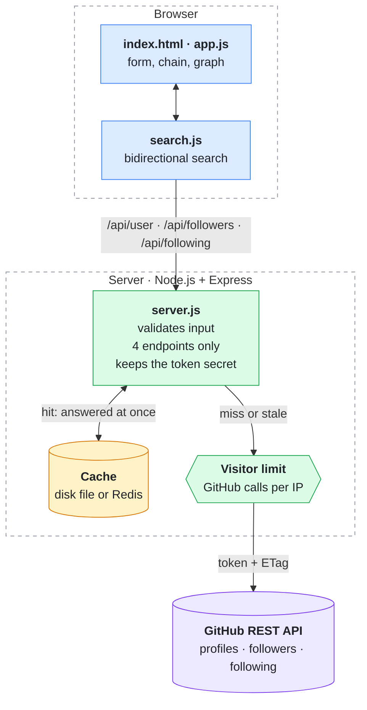
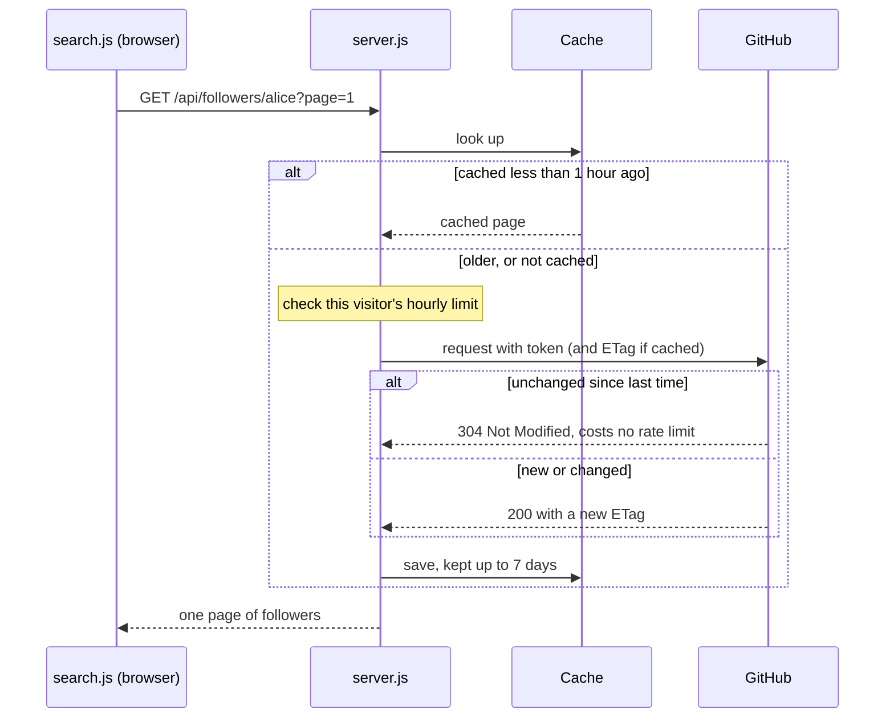

# smallworld

Find the shortest follow chain between two GitHub users.

Enter a source and a target username, and smallworld shows the chain of people linking them, both as a
row of profiles with arrows showing who follows whom and as a graph of the accounts it explored along the
way.

## The small-world phenomenon

In 1967 the psychologist Stanley Milgram asked people in the American Midwest to get a letter to a
stranger in Boston, passing it only through personal acquaintances. The letters that arrived took about
six hops on average. That became the popular idea of "six degrees of separation": everyone is connected to
everyone else through a surprisingly short chain of people. Later work (Watts and Strogatz, 1998) explained
why. Most connections are local, but a few long-range links and well-connected hubs shrink the distance
across the whole network.

smallworld measures the same thing on GitHub, where the "acquaintance" is a follow. The length of the
chain is given in **degrees** (hops): a chain of N degrees has N−1 people in between. There are two ways to
count a link:

- **Either person follows the other.** A follow in either direction counts, like an acquaintance.
- **Follow chains only.** Every step must be a follow in the forward direction (A follows B follows C).

The two can differ a lot. Many people follow popular accounts, but popular accounts rarely follow back, so
two people can be 2 degrees apart counting either direction yet 5 degrees apart as a forward chain.

## How it works

smallworld runs a **bidirectional breadth-first search**. One search grows outward from the source, the
other outward from the target, one layer of followers/following at a time. Each round expands whichever
side has fewer accounts waiting, and within a round, accounts that many others point to are checked
first, since such hubs are the likeliest to bridge the two sides. When the two searches meet, the round is
finished and the shortest chain found is returned.

In "follow chains only" mode the source side walks forward along the accounts people follow, and the
target side walks backward along their followers, so every link in the result points the right way.

Some searches can be answered from the two profiles alone. If the source follows nobody, or nobody follows
the target, no forward chain can exist, and smallworld says so without searching. Otherwise the search is
bounded by the maximum number of degrees, by how many pages of each follower list it reads, and by
GitHub's rate limit. So when it doesn't find a chain, it tells you which limit it reached: a missing
result means none was found within those limits, not that no connection exists.

Every result also has a shareable link. It carries the chain that was found, so opening it doesn't repeat
the search: the server only re-checks that each person in the chain still follows the next, then shows the
result (or runs a normal search if the chain no longer holds).

## Sharing

Each result has buttons to copy its link, share it, post it on X or LinkedIn, and download a preview
image. Posted on LinkedIn, X, WhatsApp or Slack, the link shows a card with the chain.

| URL | What it does |
|---|---|
| `/?from=alice&to=torvalds` | Fills the form and runs the search |
| `/?from=alice&to=torvalds&via=bob,carol` | Shows the chain alice → bob → carol → torvalds (up to 6 names in `via`) |
| `&mode=follow` | Follow chains only; the default is either direction |

Link previews are read by crawlers that don't run JavaScript, so the server writes the preview tags into
the page itself and draws the card as a PNG at `/og.png` (same query parameters), using
[satori](https://github.com/vercel/satori) and [resvg](https://github.com/yisibl/resvg-js).

## Architecture



- **The search runs in the browser.** `public/search.js` is a plain ES module that takes a fetch function,
  so the same code runs against the real API or a mocked graph. It also caps how many GitHub requests one
  search may spend.
- **The server is a thin, locked-down proxy.** It holds the GitHub token so it never reaches the browser,
  allows only a fixed set of endpoints, validates usernames and page numbers, and returns only the fields the
  page needs. It also serves the share-preview images. Each visitor can only cause a limited number of GitHub calls per hour.
- The frontend is plain HTML, CSS and JavaScript, with no framework and no build step. The graph is drawn
  as inline SVG.

### One lookup, and why repeat searches are cheap

Popular accounts turn up in many different searches, so every GitHub response is cached. For an hour it is
served as-is; after that it is revalidated with its ETag, and GitHub doesn't charge rate limit for an
unchanged answer. Entries are kept for up to a week.



## Running it

You need Node.js 24 and a GitHub token.

1. Create a [fine-grained personal access token](https://github.com/settings/personal-access-tokens/new)
   with **read-only access to public repositories**. It's only used to read public profiles and follower
   lists. The app also works without one, but GitHub then allows only 60 requests an hour.
2. Put it in a `.env` file:
   ```
   cp .env.example .env
   # then set GITHUB_TOKEN=... in .env
   ```
3. Install and start:
   ```
   npm install
   npm start
   ```
4. Open <http://localhost:3000>. Set `PORT` to use a different port, and `PUBLIC_URL` to the address the site is served from (default
   `http://localhost:3000`) so shared previews contain full links.
